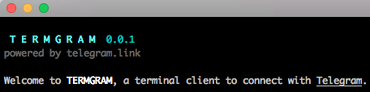

#  

##TERMGRAM

###A terminal client to connect with [Telegram](http://www.telegram.org).

The main purpose of the project is to provide a working **example** of 
how to use the [**telegram.link**](http://telegram.link) library in order to build a Telegram client application

## Install & Run

```bash
$ npm install -g termgram
$ termgram
```

## Node.js 0.12.x
In order to take advantage of some new Javascript features, the **Node.js version required is the 0.12.x**

**Note:** [**telegram.link**](http://telegram.link) just requires the version **0.10.X**

### License

The project is released under the [MIT license](./LICENSE) 

